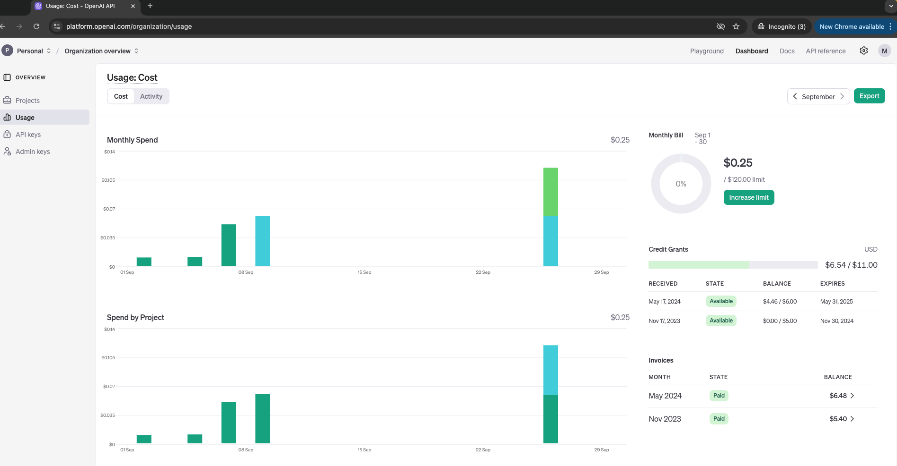

# OpenAI Platform Usage Guide

This guide provides instructions on how to log into the OpenAI platform, view your API key, and check your remaining token balance.

## Prerequisites

- An OpenAI account. If you don't have one, you can sign up at [OpenAI](https://beta.openai.com/signup/).
- Access to the OpenAI platform dashboard.

## Instructions

### 1. Log into the OpenAI Platform

1. Go to the [OpenAI Platform](https://platform.openai.com/).
2. Click on the **Sign In** button in the top-right corner.
3. Enter your registered email address and password, or sign in using Google if you have linked your account.

### 2. View Your API Key

1. Once logged in, navigate to the **API Keys** section:
   - Click on your profile icon in the top-right corner.
   - Select **View API Keys** from the dropdown menu.

2. You will see a list of your existing API keys. If you don’t have an API key yet, click on the **Create new secret key** button.

3. Copy the API key displayed, and store it securely. You will need it to authenticate your API requests.

   **Important:** Never share your API key publicly, as it can be used to access your account.

### 3. Check Your Token Usage

1. Navigate to the **Usage** section:
   - Click on your profile icon in the top-right corner.
   - Select **Manage Account** from the dropdown menu.
   - Click on the **Usage** tab on the left-hand side.

2. You will see a detailed view of your token usage, including:
   - **Daily Token Usage**: A breakdown of how many tokens you’ve used each day.
   - **Cumulative Token Usage**: A graphical representation of your cumulative token usage over time.

3. You can filter the data by date range using the date picker at the top of the page.

### 4. Check Your Remaining Token Balance

1. Go to the **Billing** section:
   - Click on your profile icon in the top-right corner.
   - Select **Manage Account** from the dropdown menu.
   - Click on the **Billing** tab on the left-hand side.

2. You will see your billing details, including:
   - **Current Balance**: The amount spent so far in the current billing cycle.
   - **Usage Limits**: Your daily and monthly usage limits.

3. To view your remaining token balance, compare your current usage with your monthly limit. This will give you an idea of how many tokens you have left.

### 5. Additional Information

- If you need to manage your API keys, navigate to the **API Keys** section and click on the **Revoke** button next to an existing key to deactivate it.
- For detailed usage reports or to view invoices, go to the **Billing History** section under **Billing**.

### 6. Billing Dashboard Demo

## Troubleshooting

- **Cannot Access API Key**: If you can't access your API key, ensure that you have appropriate permissions. Contact OpenAI support if you need further assistance.
- **Exceeded Usage Limits**: If you have exceeded your usage limits, consider upgrading your plan or adjusting your usage settings in the **Manage Account** section.

## References

- [OpenAI Platform](https://platform.openai.com/)
- [OpenAI Documentation](https://beta.openai.com/docs/)

# OpenAI Token Pricing and Model Parameters

## Token Pricing

OpenAI charges based on the number of tokens processed in each API request. Tokens are chunks of words, typically averaging about 4 characters. A single token can be as short as one character or as long as one word. Here’s a quick breakdown:

- **1 Token ≈ 4 Characters** or ≈ 0.75 words in English.
- **Pricing Example**: If a model processes 1,000 tokens at $0.002 per token, the cost would be $2.00.
- Both input and output tokens are counted towards the total token usage.

For detailed pricing information, visit the [OpenAI Pricing](https://openai.com/pricing) page.

## Model Parameters

### `temperature`
- **Definition**: Controls the randomness of the model's output.
- **Range**: `0.0` to `1.0`
- **Default**: `1.0`
- **How It Works**: Lower values like `0.2` make the output more deterministic and focused, while higher values like `0.8` increase creativity and randomness.

### `top_p`
- **Definition**: Implements nucleus sampling, limiting the model to consider only the most probable token options.
- **Range**: `0.0` to `1.0`
- **Default**: `1.0`
- **How It Works**: A `top_p` of `0.9` means the model will only consider the top 90% of probable next tokens, reducing the likelihood of less probable options. It can be used to control the diversity of the output.

### `max_tokens`
- **Definition**: Sets the maximum number of tokens in the response.
- **Usage**: Limits the length of the generated output to prevent excessive responses.

### `frequency_penalty`
- **Definition**: Penalizes new tokens based on their existing frequency in the text.
- **Range**: `-2.0` to `2.0`
- **Usage**: A positive value reduces the repetition of words, while a negative value encourages repetition.

### `presence_penalty`
- **Definition**: Penalizes new tokens based on whether they appear in the text at all.
- **Range**: `-2.0` to `2.0`
- **Usage**: A positive value encourages new topics to be discussed in the response.

## Summary

Adjusting these parameters allows fine-tuning of the model's behavior to generate more focused, creative, or diverse responses. For more details, refer to the [OpenAI API Documentation](https://beta.openai.com/docs/).